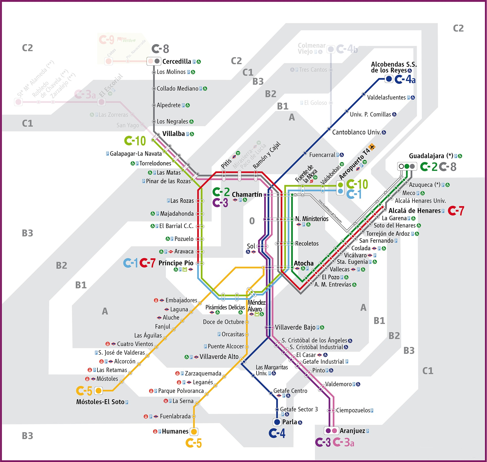
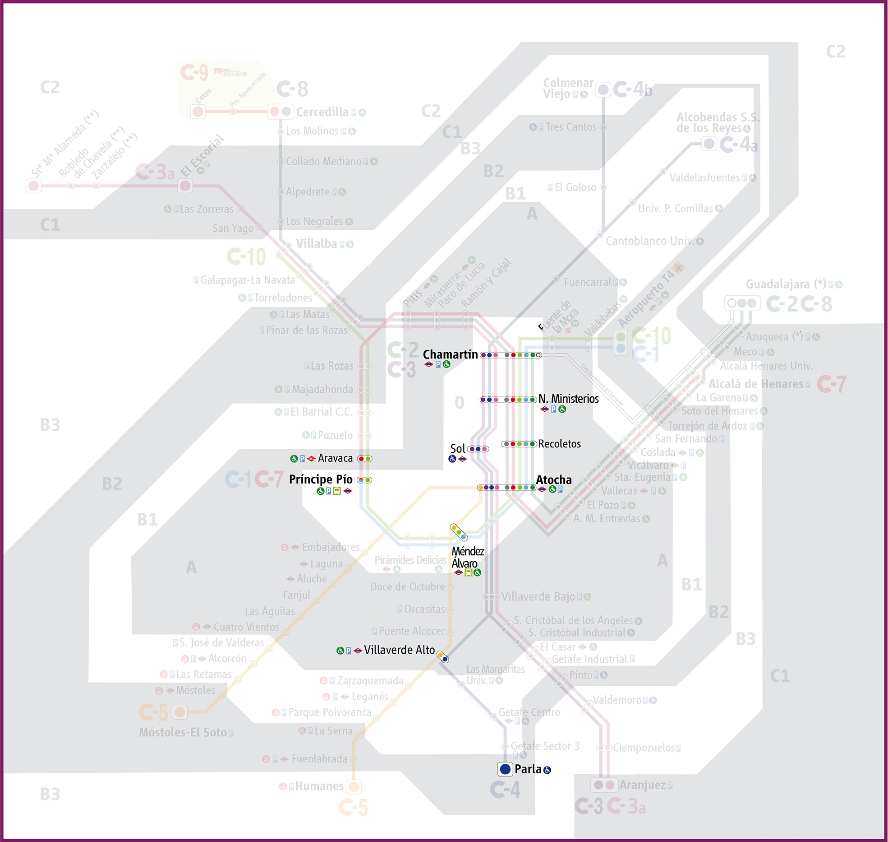
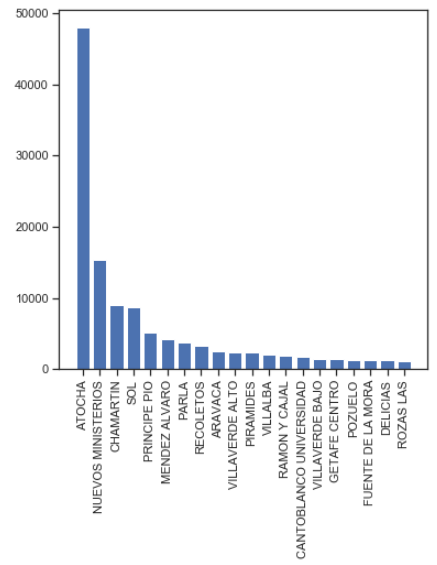
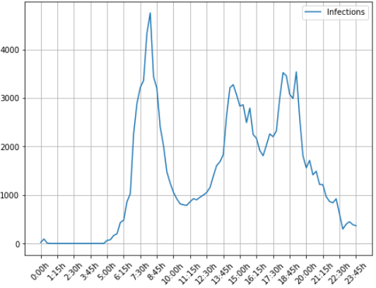

# Infection simulation in a transport network

## Introduction

Due to the COVID-19 pandemic, I was interested in how a virus would spread in a transport network. It is particularly interesting to see how central hubs contribute to spread the infection and which times are *the most dangerous* to travel.

In order to observe how a virus spreads in a network, in this project I run a one-day simulation based on the passenger flow.

## Data

In this project, I have used the data of the **Renfe Cercanias** transport network in **Madrid (Spain)**, but you can run the code using your own network (bus, flights, ...).

Turnstiles data, route timetables and station locations:
- http://crtm.maps.arcgis.com/home/item.html?id=1a25440bf66f499bae2657ec7fb40144
- https://data.renfe.com/dataset/volumen-de-viajeros-por-franja-horaria-madrid

At the time that I am writing this text, there are some limitations in the above data:
- There is no data for the newest station: *Mirasierra-Paco de Lucía*.
- There is no data in two lines: *C-3a* and *C-4b*.
- Line *C-9* do not have turnstiles, thus there is no data of any station.

Hence, after excluding those stations with missing data, the network looks like this:

  

## Model

### Flow of passengers

I have used the library [Mesa](https://mesa.readthedocs.io/) to implement an **Agent Based Model** to simulate the flow of passengers in the network.

In order to simulate the flow in a realistic way, I have used the turnstiles data of each station at each time. Based on such data, each station (and also each line) has a certain *in-weight* and *out-weight* (depending on the number of incoming and outcoming passengers).

At each time step, a certain number of passengers join the network randomly:
1. Depending on the time, `N` passengers join the network. That is, if it is a peak hour, more passengers will join it.
2. Each passenger is assigned to a station randomly (origin station) depending on the *in-weight* of the station and time.
3. Each passenger (randomly) goes to a platform in the station depending on the weight of that platform. The weight depends on the sum of *in-weights* of the next stations.
4. Finally, the passengers waits in the platform until a train arrives.

The passenger who are in a train:
1. Leave the network (arrival to destination) depending on the *out-weight* of the station and time.
2. Stay in the train or change to other platform depending on the weight of the platforms.

You can see a **short animation of the passengers flow** (note that some nodes suddenly become blue/gray when a train arrives to the node and takes the passengers who are waiting for it): [./images/flow-sim.gif](./images/flow-sim.gif)

### Infection

I have used a SEI Model which consists of 3 states:
- Susceptible (S): a healthy person who can be infected.
- Exposed (E): incubation period during which individuals have been infected but are not yet infectious themselves.
- Infected (I): people who are capable of infecting susceptible individuals.

Once a susceptible individual (state *S*) has been infected by another passenger (state *I*), his/her new state changes from *S* to *E*. Since I am planning to run a **one-day simulation**, I do not use a SEIR Model (which includes the state *Recovered*).

Then, an infected individual may infect others with a certain probability `p` to susceptible people who are in the sample place:
- When s/he is waiting for a train in a platform.
- When s/he is traveling in a train.

Here is **an animation** where you can see the **total number of infected/exposed passengers** in the network: [./images/infect-sim.gif](./images/infect-sim.gif)

### Additionial constrains/limitations

There are some additional constraints to take into account:
- A passenger cannot join a station/platform whether there are no more expected trains or the next train comes in more than `30` minutes (feel free to change it for your own network).
- A passenger may change to other platform, but they **cannot change to a platform of the same line**. This allow me to force that passengers do not do "useless transfers".
- In my network, I limited that each passenger can make **one only transfer** to another line.
- In real life, if there are only 2 passengers in a platform, the most likely is that one cannot infect to the other (due to the physical separation between them). However, this model is simple, so they may get infected anyway.

## Results

Please, take a look to the notebook [NetworkSimulation](./notebooks/NetworkSimulation.ipynb) for further details about **parameters** and **additional results**.

After running the simulation, I noticed that the most infection happen not only in central hubs (as I expected) but also in stations where passengers wait for a long time:

  

Here are the top 20 stations with more infections:

  

Furthermore, it is interesting to see how the most infections happen during peak hours:

  

## Code

You can see the code details in the folder [notebooks](./notebooks)
